## <span style="color:red;">Sets of Real Numbers and the Cartesian Coordinate Plane</span>
### <span style="color:orange;">Set of Numbers</span>
Definition of **Set** and describe Set

There is some Sets of Number 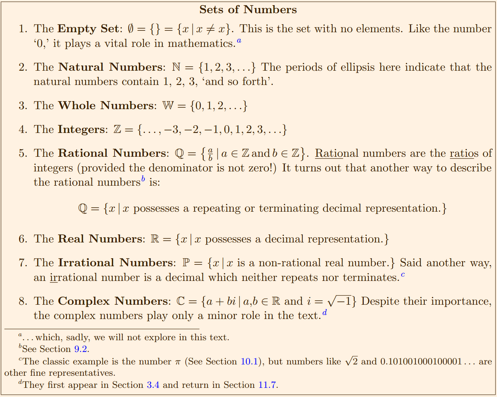
 
If we visualize R as a line. Segments of this line are called **intervals** of numbers. **Interval notation** associated with given sets of number 

We will often have to combine sets. There are two basic way to combine set: **intersection** and **union** 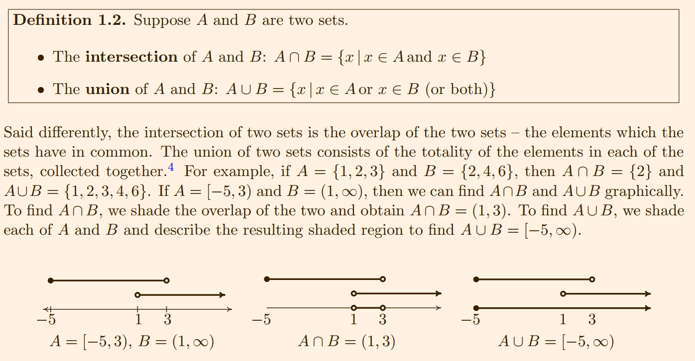


### <span style="color:orange;">The Cartesian Coordinate Plane</span>
In order to visualize the pure excitement that is Precalculus, we need to unite Algebra and Geometry. Simply put, we must find a way to draw algebraic things
Let's start with possibly the greatest mathematical achievement of all time: the **Cartesian Coordinate Plane**
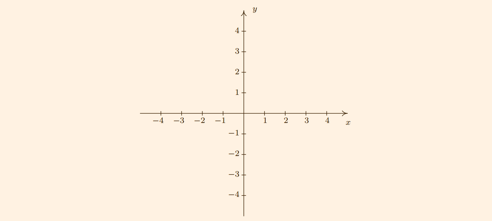
The horizontal number line is usually called the **x-axis** while the vertical number line is usually called the **y-axis**.
We then describe the point P using the **ordered pair** (2; −4). The first number in the ordered pair is called the **abscissa** or **x-coordinate** and the second is called the **ordinate** or **y-coordinate**.


The axes divide the plane into four regions called **quadrants**. They are labeled with Roman
numerals and proceed counterclockwise around the plane:
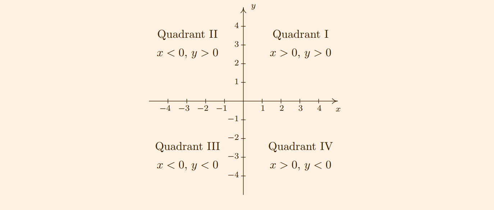

One of the most important concepts in all of Mathematics is **symmetry**. There are many types of
symmetry in Mathematics, but three of them can be discussed easily using Cartesian Coordinates.
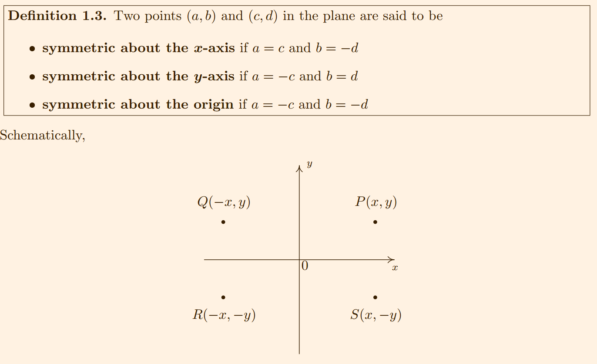


### <span style="color:orange;">Distance in the Plane</span>
Another important concept in Geometry is the notion of length. If we are going to unite Algebra and Geometry using the Cartesian Plane, then we need to develop an algebraic understanding of what distance in the plane means.
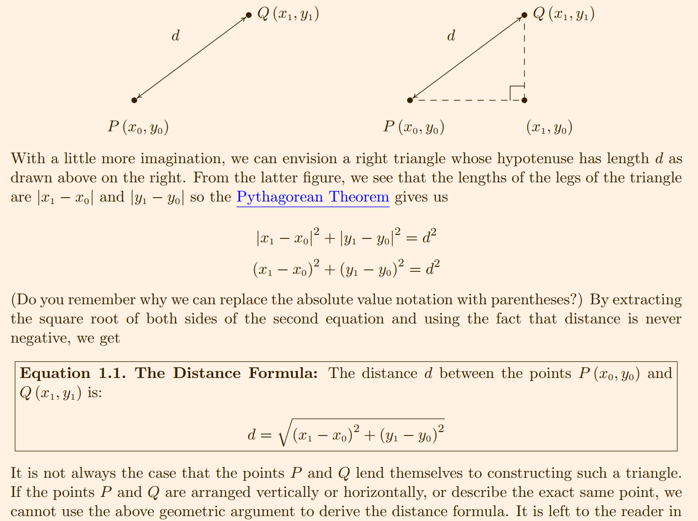

Related to fuinding the distance between two points is the problem of finding the **midpoint** of the line segment connecting two points.
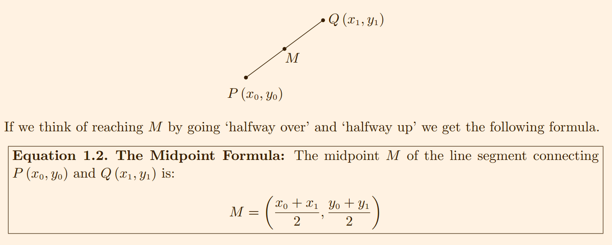


## <span style="color:red;">Relations</span>
---
A **Relation** is a set of points in the plane.
Consider the relation R = {(-2,1),(4,3),(0,-3)}. R is described using the roster method. Since R consists of points in the plane, we follow our instinct and plot the points. Doing so products the **graph** of R
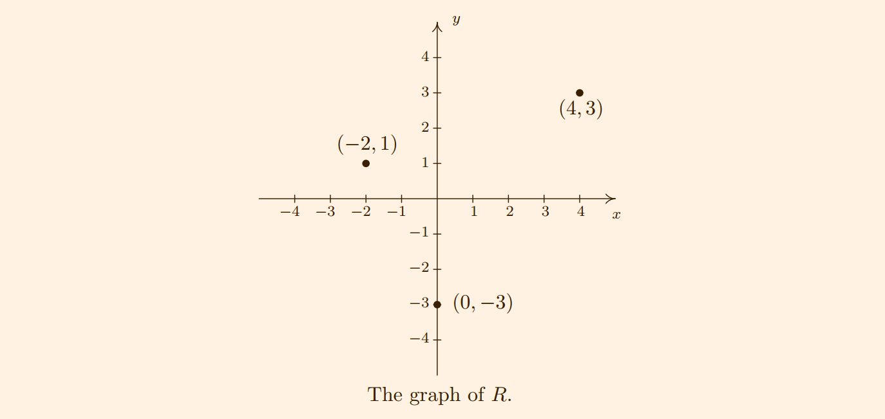

In the following example, we graph a variety of relations:

Here are solutions:
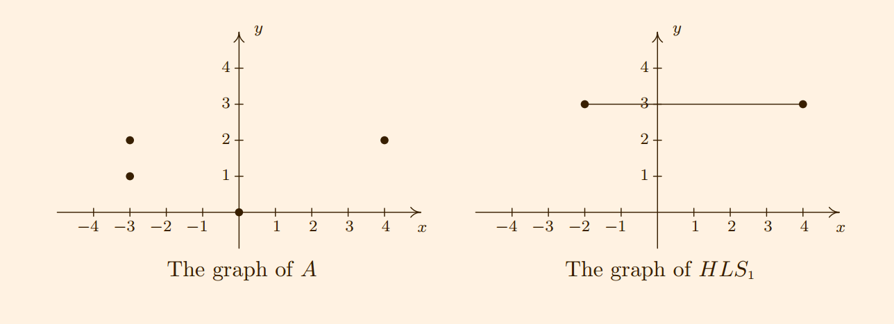
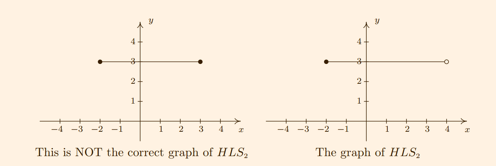
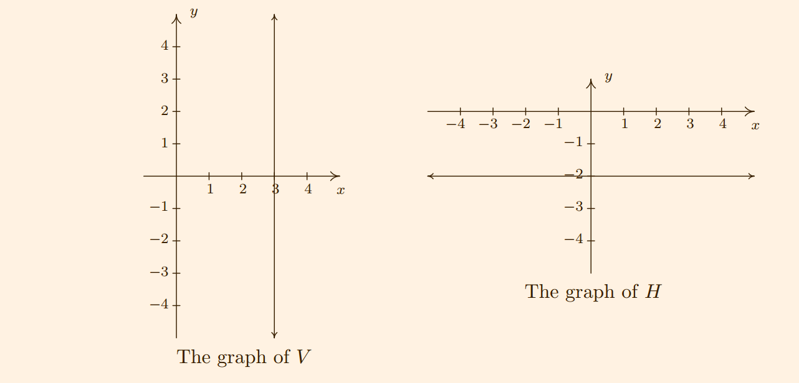
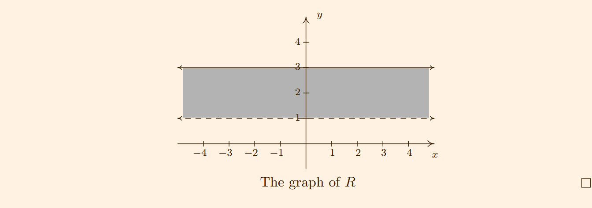

The relations V and H in the previous example lead us to our final way to describe relations: **algebraically**


### <span style="color:orange;">Graphs of Equations</span>

Hear, 'x and y satisfy the equation' means 'x and y make the equation true'


Example:
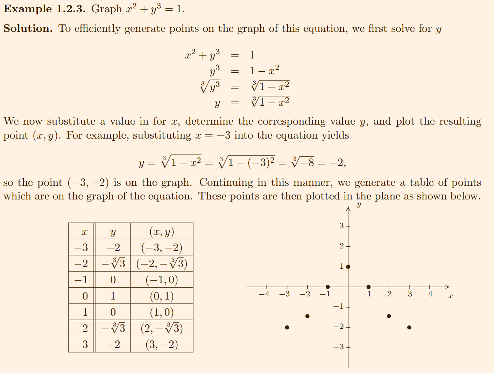


Of all of the points on the graph of an equation, the places where the graph croesses or touches the axes hold special significance. These are called the **intercepts** of the graph. Intercepts come in two distinct varieties: _x-intercepts_ and _y-intercepts_
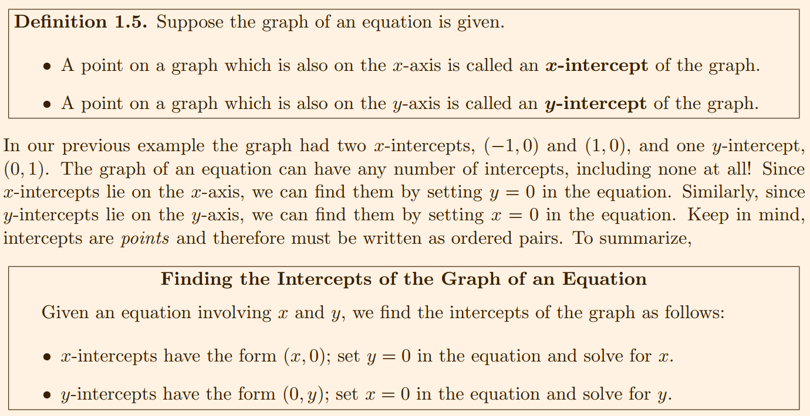


## Note

```
Trước khi hệ trục toạ độ ra đời thì các giá trị chỉ nằm trên một đường thẳng: 
vô cực âm -> 0 -> vô cực dương

Sự ra đời của mặt phẳng hệ trục toạ độ(Cartesian Coordinate Plane) cho ra các hệ giá trị mới, các gía trị
đó có thể được biểu diễn trên mặt phẳng hệ trục toạ độ. Đây là không gian hai chiều đo đó các giá trị trên
mặt phẳng được gọi là các điểm(Point), bao gồm x và y tương ứng với mỗi chiều trên mặt phẳng hệ trục toạ độ.

Tập hợp(Set) các điểm sẽ được gọi là Relation. Khi vẽ các điểm đó lên hệ trục toạ độ sẽ sinh ra Graph

Các đẳng thức(Equations) với hai biến số (x và y). ví dụ: ax + by = c
Khi kết hợp với mặt phẳng hệ trục toạ độ sẽ cho ra các cặp x và y thoã mãn đẳng thức. Các cặp x và y này 
vô tình lại chính là các điểm có thể biểu diễn được trên mặt phẳng hệ trục toạ độ. các biểu diễn đó sẽ được
gọi là Graph of Equations.

Trong các trường hợp đặt biệt, Graph of Equations vô tình cắt trúng các trục toạ độ (trục x và trục y). Các
trường hợp đặc biệt đó sẽ cho ra x và y với một trong hai mang giá trị 0.
Nếu Graph cắt trục x, sẽ cho ra điểm với x = 0 và y mang giá trị bất kì. Điểm đó được gọi là x-intercept
Nếu Graph cắt trục y, sẽ cho ra điểm với y = 0 và x mang giá trị bất kì. Điểm đó được gọi là y-intercept
```